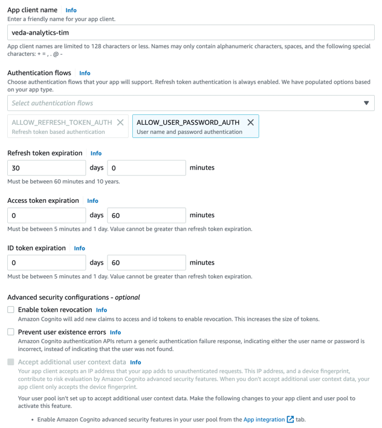
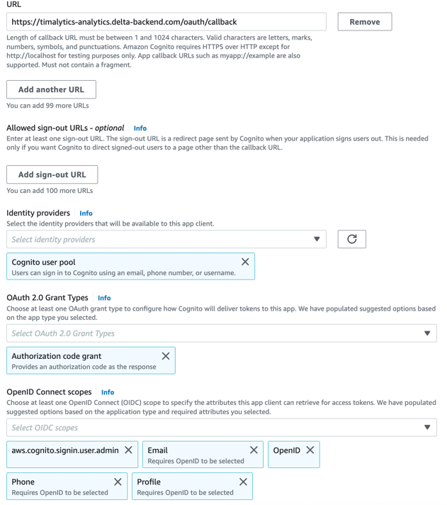
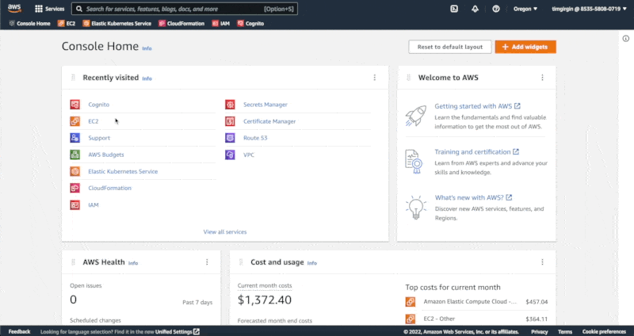

# JupyterHub on Eclipse Che

Infrastructure for providing JupyterHub environments via [Eclipse Che](https://github.com/eclipse/che) and Kubernetes.

## Scope and state

In using Eclipse Che, we follow a similar approach to [NASA MAAP](https://github.com/MAAP-Project/), but attempting to build on the newest version of [Eclipse Che](https://github.com/eclipse/che).

The infrastructure here supports an MVP with Eclipse Che, JupyterHub, and AWS Cognito authentication, but is left here for information and documentation. We are happy to share our lessons learned and other gotchas with this setup upon request.

## Deploying the infrastructure

### 1. Building the image

This step is _optional_ and useful only if you are developing locally and need to test your deployment. If you are just trying to deploy a new cluster without having made any changes locally, you can skip this step.

`docker build . -t veda`

**NOTE**: if you are on an M1 Mac, you have to include the `--platform=linux/amd64` tag to your docker commands to avoid compatibility issues.

### 2. Running the image

After building the image, it's time to run it to deploy the infrastructure.
Make sure that you have created a `.env` file that contains all the required environment variable that are needed for the deployment to properly work.
You can use the `.env.template` file to create and fill your `.env` file.

`docker run --env-file ./.env -it veda:latest bootstrap-and-deploy`

**NOTE**: This takes approximately 35-40 minutes to run.

### Creating a new cognito app client

If you are deploying a new cluster with a unique/new `QUALIFIER`, you must create a new cognito app client as well to integrate the correct callback URL for auth.

To do so, head to [Cognito's create app client page](https://us-west-2.console.aws.amazon.com/cognito/v2/idp/user-pools/us-west-2_OJVQQhBQQ/app-integration/create/client?region=us-west-2) and match (except for the client name) the screenshots below

You can then copy the app's client name and secret and add them to the docker run's environment variable.

**NOTE**: The callback URL should match this syntax `https://{QUALIFIER}-analytics.delta-backend.com/oauth/callback`

## Adding a user to gain access to che

To add a user, follow the gif below

## Destroying a cluster

If you do not need to have a particular cluster running, you can destroy all its resources by running:

`docker run --env-file ./.env-it veda:latest destroy`

**NOTE**: This takes approximately 25-30 minutes to run
